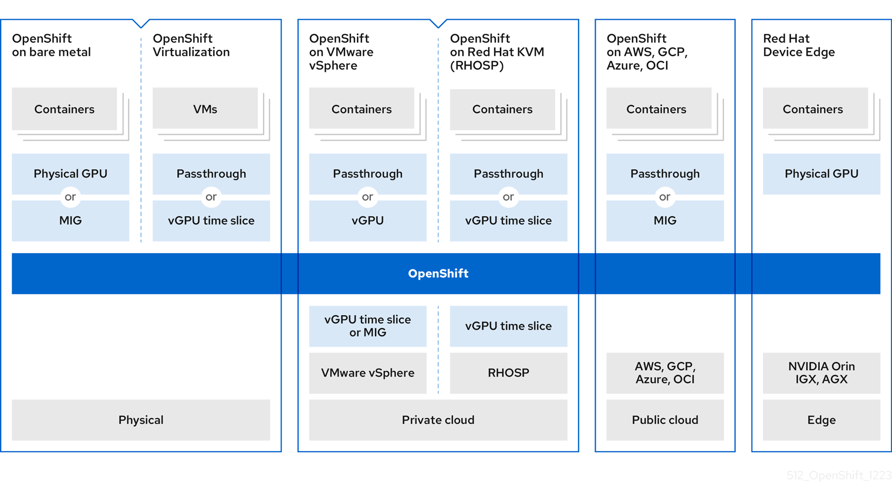

**OCP**
- security-focused & hardened k8s platform, _developed & supported by RH,_ for deploying & managing k8s clusters @ scale

**GPU Arch**
- GPU Operator uses Operator f/w inside OCP to manage full LC of its s/w components, tht r reqd to run GPU-accelerated workloads
- These s/w components include
	- nvidia drivers to enable CUDA
	- k8s device plugin for GPUs
	- nvidia Container Toolkit
	- automatic node tagging using GPU Feature Discovery (**GFD**)
		- For this to work, 
			- NodeFeatureDiscovery (**NFD**) Operator should be installed &
			- `nodefeaturediscovery` instance should be created
	- DCGM-based monitoring

**How GPU Arch can be enabled for openShift?**
	
	

- **GPUs & BareMetal**
	- Deploy OCP on nvidia-certified BareMetal svc but wid some limitations:
		- ctrl plane nodes can be CPU nodes
		- worker nodes must be GPU nodes, hosting >=1 GPUs of same type/flavor
			- nvidia device plugin for k8s doesn't support mix of diff. GPU models/type/flavor on same node
		- 1 or 3 svrs r reqd
			- Clusters wid 2 svrs r not supported
	- To access containerized GPUs, use 1 of the 2 methods
		- GPU passthrough
		- MIG

- **GPUs & Virtualization**
	- RHOS Virtualization incorporates VMs into containerized workflows within clusters
		- This helps develop & maintain apps tht run on VMs
	- To connect worker nodes to GPUs, use 1 of the 2 methods
		- GPU passthrough to access & use GPU h/w within a VM
		- GPU (vGPU) time-slicing

- **GPU Sharing Methods** -- _GPU Concurrency Mechanisms_

| CUDA Streams                                                                                                                                                                                                                                                                                                                                                                                                                                                                                                                                                                                                  | CUDS MPS                                                                                                                                                                                                                                                                                                                                                                                                                                                                                                                                                                                                                                                                                                                                                                                                                        | Time-Slicing                                                                                                                                                                                                                                                                                                                                                                                                                                                                                                                                                                                                                                                                                                                                                                                                                                                                                                                                                                                       | MIG                                                                                                                                                                                                                                                                                                                                                                                                                                                                                                                                                                                                                                                                                                                                                                                                                                                                                              | vGPU                                                                                                                                                                                                                                                                                                                                                                                                                                                                                                                                                                                         |
| ------------------------------------------------------------------------------------------------------------------------------------------------------------------------------------------------------------------------------------------------------------------------------------------------------------------------------------------------------------------------------------------------------------------------------------------------------------------------------------------------------------------------------------------------------------------------------------------------------------- | ------------------------------------------------------------------------------------------------------------------------------------------------------------------------------------------------------------------------------------------------------------------------------------------------------------------------------------------------------------------------------------------------------------------------------------------------------------------------------------------------------------------------------------------------------------------------------------------------------------------------------------------------------------------------------------------------------------------------------------------------------------------------------------------------------------------------------- | -------------------------------------------------------------------------------------------------------------------------------------------------------------------------------------------------------------------------------------------------------------------------------------------------------------------------------------------------------------------------------------------------------------------------------------------------------------------------------------------------------------------------------------------------------------------------------------------------------------------------------------------------------------------------------------------------------------------------------------------------------------------------------------------------------------------------------------------------------------------------------------------------------------------------------------------------------------------------------------------------- | ------------------------------------------------------------------------------------------------------------------------------------------------------------------------------------------------------------------------------------------------------------------------------------------------------------------------------------------------------------------------------------------------------------------------------------------------------------------------------------------------------------------------------------------------------------------------------------------------------------------------------------------------------------------------------------------------------------------------------------------------------------------------------------------------------------------------------------------------------------------------------------------------ | -------------------------------------------------------------------------------------------------------------------------------------------------------------------------------------------------------------------------------------------------------------------------------------------------------------------------------------------------------------------------------------------------------------------------------------------------------------------------------------------------------------------------------------------------------------------------------------------- |
| <ul><li>ComputeUnifiedDeviceArchitecture (**CUDA**) streams -- _within single app_ </li>  <li>CUDA is a platform for parallel computing & programming model, developed by nvidia, for general computing on GPUs </li>  <li> Stream is a sequence of operations that execute issue-order on GPU   <ul><li> New task doesn't start until preceding task is completed </li></ul></li>  <li> Async processing of operations across diff. streams helps achieve parallel execution of multiple tasks simultaneously, in no prescribed order, leading to improved performance </li> <ul> | <ul><li> CUDA Multi-Process Svc (**MPS**) -- _for multiple apps in multi-user environment_ </li>  <li> allows single GPU  to use multiple CUDA processes to run in parallel on GPU, to eliminate saturation of GPU compute resources </li>  <li> MPS also enables concurrent execution or overlapping, of kernel operations & memory copying from diff. processes to enhance utilization </li>  <li> MPS is a server-client model where the MPS control daemon runs on the server, and multiple client applications connect to it </li>  <li> MPS server manages GPU resources and schedules tasks from different processes, allowing them to share the GPU efficiently </li>  <li> MPS can reduce the overhead associated with context switching between different CUDA processes </li> </ul> | <ul><li>Good for older nvidia cards </li>  <li> interleaves workloads, tht r scheduled on overloaded GPU, when multiple CUDA apps r running </li>  <li> time-slicing can b enabled by defining set of replicas for a GPU, each of which can be independently distributed to a pod, to run workloads on   <ul><li> Example, if a GPU is split into 7 slices, each slice is allocated to an individual pod, making it 7 pods for a single GPU </li></ul></li>  <li> Thr is no memory or fault isolation b/w replicas, i.e., memory is not sliced/shared, stays same full amount of memory, for each slice </li>  <li> This is used to multiplex workloads from replicas of same underlying GPU </li>  <li> time-slicing can b applied cluster-wide as well as node-specific   <ul><li> We do node-specific slicing, by labeling nodes wid node-specific cfg </li>  <li> This helps provide diff. GPU flavors in the cluster </li></ul></li> </ul> | <ul><li>Good for MIG-enabled cards on BareMetal </li>  <li> MIG is only supported with A30, A100, A100X, A800, AX800, H100, and H800 </li>  <li> MIG can b used to split GPU compute units & memory, into multiple MIG instances   <ul><li> Each instance represents a standalone GPU device from a system perspective & can b connected to any app, container or a VM on that node </li>  <li> s/w tht uses GPU, treats each MIG instance as individual GPU </li></ul></li>  <li> useful wen app doesnt require full power of GPU </li>  <li> nvidia Ampere enables to split h/w resources into multiple GPU instances, wid each instance avl to OS, as an independent CUDA-enabled GPU </li>  <li> GPU instances r designed to support up to 7 independent CUDA apps, tht can operate completely isolated wid dedicated h/w resources </li> </ul> | <ul><li>Best choice for VMs </li>  <li> VMs can directly access a single GPU by using nvidia vGPU </li>  <li> vGPUs can b created n shared by multiple VMs across the enterprise & can b accessed by other devices   <ul><li> This capability helps combine power of GPU performance wid mgmt & security benefits, provided by vGPU, along with    <ul><li> proactive mgmt & monitoring of VM environment, </li>  <li> workload balancing for mixed VDI & compute workloads, </li>  	<li> resource sharing across multiple VMs </li></ul></li></ul></li> |
|                                                                                                                                                                                                                                                                                                                                                                                                                                                                                                                                                                                                               |                                                                                                                                                                                                                                                                                                                                                                                                                                                                                                                                                                                                                                                                                                                                                                                                                                 |                                                                                                                                                                                                                                                                                                                                                                                                                                                                                                                                                                                                                                                                                                                                                                                                                                                                                                                                                                                                    |                                                                                                                                                                                                                                                                                                                                                                                                                                                                                                                                                                                                                                                                                                                                                                                                                                                                                                  |                                                                                                                                                                                                                                                                                                                                                                                                                                                                                                                                                                                              |

**Scenarios & recommendations:**

| Scenario                                               | Recommendation                                                                                  |
| ------------------------------------------------------ | ----------------------------------------------------------------------------------------------- |
| VMs wid multiple GPUs, using passthrough & vGPU        | Use separate VMs                                                                                |
| BareMetal wid openShift Virtualization & multiple GPUs | <ul><li> Use pass-through for hosted VMs & </li> <li> time-slicing for containers </li></ul> |
|                                                        |                                                                                                 |

**CUDA Streams vs MPS: Key Differences**

| S.No. | Criteria        | Streams                                                                                                        | MPS                                                                                                 |
| ----- | --------------- | -------------------------------------------------------------------------------------------------------------- | --------------------------------------------------------------------------------------------------- |
| 1.    | Scope           | Operates within a **single process**, allowing that process to manage multiple streams of execution on the GPU | Operates across **multiple processes**, enabling them to share the GPU resources concurrently       |
| 2.    | Concurrency Lvl | Manage concurrency at the **task level** within a single app                                                   | Manages concurrency at the **application level**, allowing multiple processes to run simultaneously |
| 3.    | Use Cases       | Useful for optimizing the performance of a single application by managing internal concurrency                 | Useful for multi-user or multi-application environments where GPU resources need to be shared       |

**nvidia GPU features for OCP**

| Container Toolkit                                                                                                                                                                   | GFD                                                                                                                                                                                                                                                                                                                                                                                                                                                                                                                                                                                                                                                | DCGM                                                                                                                                                                                                                                                                                                                                | OS Virt                                                                                                                                                                                                                            | AI Enterprise                                                                                                                                                                                                                                                                                                                         |     |
| ----------------------------------------------------------------------------------------------------------------------------------------------------------------------------------- | -------------------------------------------------------------------------------------------------------------------------------------------------------------------------------------------------------------------------------------------------------------------------------------------------------------------------------------------------------------------------------------------------------------------------------------------------------------------------------------------------------------------------------------------------------------------------------------------------------------------------------------------------- | ----------------------------------------------------------------------------------------------------------------------------------------------------------------------------------------------------------------------------------------------------------------------------------------------------------------------------------- | ---------------------------------------------------------------------------------------------------------------------------------------------------------------------------------------------------------------------------------- | ------------------------------------------------------------------------------------------------------------------------------------------------------------------------------------------------------------------------------------------------------------------------------------------------------------------------------------- | --- |
| <ul><li>helps create & run GPU-accelerated containers </li>  <li> includes container runtime library & utilities to automatically configure containers to use GPUs </li></ul> | <ul><li>s/w component tht enables automatic generation of labels for GPUs, avl on a node  <ul><li> uses NodeFeatureDiscovery(NFD) to perform this labeling </li>  <li> NFD Operator is avl in operatorHub as **Node Feature Discovery**</li></ul></li>  <li> manages discovery of h/w features & cfgs in OCP cluster by labeling nodes wid h/w-specific info </li>  <li> labels host wid node-specific attributes like <ul><li> PCI card </li> <li> kernel </li> <li> OS version etc</li></ul></li>  <li> Till here, GPU Operator only provisions worker nodes to run GPU-accelerated containers </li></ul> | <ul><li>install it to display GPU usage info on cluster **Observe** tab in OCP console </li>  <li> displays 	<ul><li> no. of avl GPUs </li> 	<li> power consumption (in watts) </li> <li> temperature (in degree Celcius) </li> 	<li>utilization (in %) </li> <li> other metrics, for each GPU </li></ul></ul> | <li>used for provisioning worker nodes for running GPU-accelerated VMs </li>  <li> can configure GPU Operator to deploy diff. s/w components to worker nodes, depending GPU workload, configured to run on those nodes </li> | <ul><li>E2E cloud-native suite of AI & data analytics s/w tht is optimized, certified & supported wid nvidia-certified systems </li>  <li> includes support for OCP towards following installation methods 	<ul><li> OCP on BareMetal </li> 	<li> OCP on VMware vSphere wid nvidia GPU or GPU passthrough </ul></li></ul> |     |
