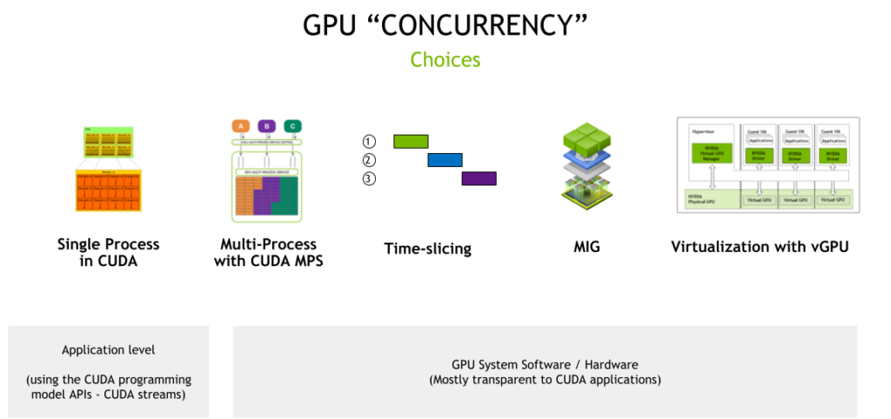

- Training giant AI models where the GPUs batch process hundreds of data samples in parallel, keeps the GPUs fully utilized during the training process
- GPU time-slicing APIs enable multiple GPU-accelerated workloads to time-slice and run on a single NVIDIA GPU




**CUDA Streams**
- async model of CUDA, allows to perform no. of operations concurrently by a single CUDA context, via CUDA streams
- Stream is a s/w abstraction tht represents sequence of cmds, which maybe a combo of computation kernels, memory copies etc, that all execute in order
- Work launched in 2 diff. streams can execute simultaneously, allowing for coarse-grained parallelism
- App can manage parallelism by using CUDA streams & stream priorities
- CUDA Streams maximize GPU Utilization for inference serving
	- Example, using streams to run multiple models in parallel
- **Trade-off:** 
	- APIs can only be used within a single app, thereby offering limited h/w isolation, as all resources r shared & error isolation b/w various streams
- CUDA exposes the following operations as independent tasks that can operate concurrently with one another:
	- Computation on the host;
	- Computation on the device;
	- Memory transfers from the host to the device;
	- Memory transfers from the device to the host;
	- Memory transfers within the memory of a given device;
	- Memory transfers among devices.

**Time-slicing**
- simple oversubscription strategy to leverage GPU's time-slicing scheduler; for dealing wid multiple CUDA apps, each of which may not fully utilize GPU's resources
	- This is supported by **compute preemption**, starting wid Pascal Arch
- This technique is also called temporal GPU sharing
- **Trade-off**: 
	- carries a cost for context switching b/w diff. CUDA apps, tht benefit underutilized apps
	- increased latency, jitter, and potential out-of-memory (OOM) conditions when many different applications are time-slicing on the GPU
- This time-slice duration for CUDA apps is configurable through `nvidia-smi` utility
```bash
nvidia-smi compute-policy --help

    Compute Policy -- Control and list compute policies.

    Usage: nvidia-smi compute-policy [options]

    Options include:
    [-i | --id]: GPU device ID's. Provide comma
                 separated values for more than one device

    [-l | --list]: List all compute policies

    [ | --set-timeslice]: Set timeslice config for a GPU:
                          0=DEFAULT, 1=SHORT, 2=MEDIUM, 3=LONG

    [-h | --help]: Display help information
```


**CUDA MPS**_(Multi-ProcessSvc)_
- its an alternative, binary-compatible implementation of the CUDA API
- MPS runtime architecture is designed to transparently enable co-operative multi-process CUDA applications, typically MPI jobs, to utilize Hyper-Q capabilities on the latest NVIDIA (Kepler-based) Tesla and Quadro GPUs
- MPS enables CUDA kernels from different processes, typically MPI ranks, to be processed concurrently on the GPU, when each process is too small to saturate the GPU’s compute resources
- Hyper-Q allows CUDA kernels to be processed concurrently on the same GPU; 
	- this can benefit performance when the GPU compute capacity is underutilized by a single application process
- Unlike time-slicing, MPS enables the CUDA kernels from different processes to execute in parallel on the GPU
- specify 
	- limits on the amount of memory allocatable (`CUDA_MPS_PINNED_DEVICE_MEM_LIMIT`) and  
	- available compute to be used by MPS clients (`CUDA_MPS_ACTIVE_THREAD_PERCENTAGE`)
- **Trade-off:**
	- limitations with error isolation, memory protection, and quality of service (QoS) as GPU hardware resources are still shared among all MPS clients

- mechanisms discussed so far rely either on 
	- changes to the application using the CUDA programming model APIs, such as CUDA streams, or 
	- CUDA system software, such as 
		- time-slicing or 
		- MPS

**MIG**_(Multi-InstanceGPU)_
- GPUs based on the NVIDIA Ampere Architecture, such as NVIDIA A100, can be securely partitioned up to seven separate GPU Instances for CUDA applications, providing multiple applications with dedicated GPU resources
- These include streaming multiprocessors (SMs) and GPU engines, such as copy engines or decoders, to provide a defined QoS with fault isolation for different clients such as processes, containers or virtual machines (VMs)
- When the GPU is partitioned, we can use the prior mechanisms of CUDA streams, CUDA MPS, and time-slicing within a single MIG instance

**vGPU**
- enables virtual machines with full input-output memory management unit (IOMMU) protection to have simultaneous, direct access to a single physical GPU
- benefits such as 
	- VM management with live VM migration and 
	- ability to run mixed VDI and compute workloads, as well as 
	- integration with a number of industry hypervisors
- On GPUs that support MIG, each GPU partition is exposed as a single-root I/O virtualization (SR-IOV) virtual function for a VM. All VMs can run in parallel as opposed to being time-sliced (on GPUs that do not support MIG)


**When to consider which concurrency mechanism** 

|                                                     | **Streams**                                          | **MPS**                                                                    | **Time-Slicing**                                                                | **MIG**                                                           | **vGPU**                                                                                |
| --------------------------------------------------- | ---------------------------------------------------- | -------------------------------------------------------------------------- | ------------------------------------------------------------------------------- | ----------------------------------------------------------------- | --------------------------------------------------------------------------------------- |
| Partition Type                                      | Single process                                       | Logical                                                                    | Temporal (Single process)                                                       | Physical                                                          | Temporal & Physical – VMs                                                               |
| Max Partitions                                      | Unlimited                                            | 48                                                                         | Unlimited                                                                       | 7                                                                 | Variable                                                                                |
| Streaming Multiprocessor (SM) Performance Isolation | No                                                   | Yes (by percentage, not partitioning)                                      | Yes                                                                             | Yes                                                               | Yes                                                                                     |
| Memory Protection                                   | No                                                   | Yes                                                                        | Yes                                                                             | Yes                                                               | Yes                                                                                     |
| Memory Bandwidth QoS                                | No                                                   | No                                                                         | No                                                                              | Yes                                                               | Yes                                                                                     |
| Error Isolation                                     | No                                                   | No                                                                         | Yes                                                                             | Yes                                                               | Yes                                                                                     |
| Cross-Partition Interop                             | Always                                               | IPC                                                                        | Limited IPC                                                                     | Limited IPC                                                       | No                                                                                      |
| Reconfigure                                         | Dynamic                                              | At process launch                                                          | N/A                                                                             | When idle                                                         | N/A                                                                                     |
| GPU Management (telemetry)                          | N/A                                                  | Limited GPU metrics                                                        | N/A                                                                             | Yes – GPU metrics, support for containers                         | Yes – live migration and other industry virtualization tools                            |
| Target use cases (and when to use each)             | Optimize for concurrency within a single application | Run multiple applications in parallel but can deal with limited resiliency | Run multiple applications that are not latency-sensitive or can tolerate jitter | Run multiple applications in parallel but need resiliency and QoS | Support multi-tenancy on the GPU through virtualization and need VM management benefits |


- oversubscribing GPUs using the new time-slicing APIs in k8s

