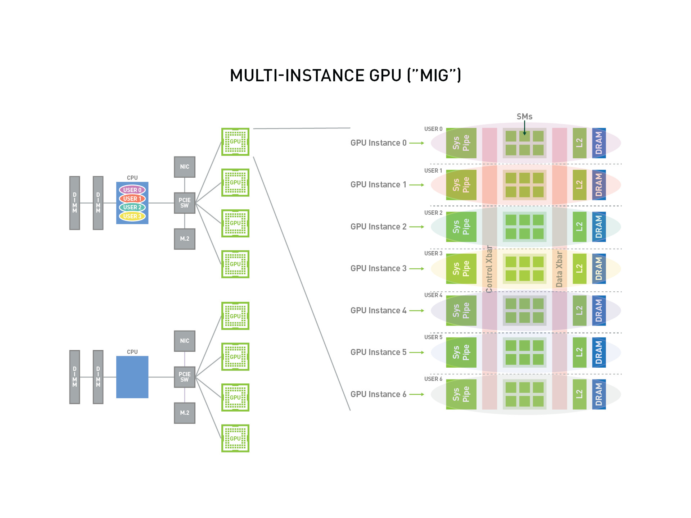
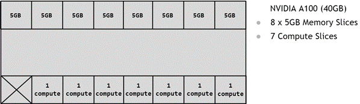

Multi-instance GPU
- This feature was first introduced with the NVIDIA® Ampere architecture
- allows GPUs to be securely partitioned into up to seven separate GPU Instances for CUDA applications, providing multiple users with separate GPU resources for optimal GPU utilization
- beneficial for workloads that do not fully saturate the GPU’s compute capacity 
	- run different workloads in parallel to maximize utilization
- each instance’s processors have separate and isolated paths through the entire memory system, be it
	- on-chip crossbar ports, 
	- L2 cache banks, 
	- memory controllers, and 
	- DRAM address busses; are all assigned uniquely to an individual instance
- ensures that an individual user’s workload can run with predictable throughput and latency, with the same L2 cache allocation and DRAM bandwidth, even if other tasks are thrashing their own caches or saturating their DRAM interface
- MIG can partition available GPU compute resources _(including streaming multiprocessors or SMs, and GPU engines such as copy engines or decoders)_, to provide a defined 
	- quality of service (QoS) 
		- with fault isolation for different clients such as VMs, containers or processes
- MIG enables multiple GPU Instances to run in parallel on a single, physical NVIDIA Ampere architecture GPU
- MIG allows multiple vGPUs (and thereby VMs) to run in parallel on a single GPU



**Terminologies**
- **Streaming Multiprocessor (SM)**
	- executes compute instructions on the GPU
- **GPU Context**
	- analogous to a CPU process
	- encapsulates all the resources necessary to execute operations on the GPU, including a 
		- distinct address space, 
		- memory allocations, etc
	- A GPU context has the following properties:
		- Fault isolation
	    - Individually scheduled
	    - Distinct address space
- **GPU Engine**
	- This is what executes work on the GPU 
	- most commonly used engine: 
		- Compute/Graphics engine that executes the compute instructions
	- Other engines:
		- copy engine (CE) that is responsible for performing DMAs, 
		- NVDEC for video decoding, 
		- NVENC for encoding, etc 
	- Each engine can be scheduled independently and execute work for different GPU contexts
- **GPU Memory Slice** -- _1/8 of total_
	- smallest fraction of the GPU’s memory, including the 
		- corresponding memory controllers and 
		- cache 
	- roughly one eighth of the total GPU memory resources, including both 
		- capacity and 
		- bandwidth
- **GPU SM Slice** -- _1/7 of total_
	- smallest fraction of the SMs on the GPU
	- roughly one seventh of the total number of SMs available in the GPU when configured in MIG mode
- **GPU Slice** _(1/8 of total Memory + 1/7 of total SM)_
- smallest fraction of the GPU that combines a 
	- single GPU memory slice and a 
	- single GPU SM slice
- **GPU Instance (GI)**
	- combination of 
		- GPU slices and 
		- GPU engines (DMAs, NVDECs, and so on)
	- Anything within a GPU instance always shares 
		- all the GPU memory slices and 
		- other GPU engines, 
	- but it’s SM slices can be further subdivided into compute instances (CI)
	- A GPU instance provides memory QoS
	- Each GPU slice includes dedicated GPU memory resources which limit 
		- both the available capacity and bandwidth, and 
		- provide memory QoS
- **Compute Instance (CI)**
	- A GPU instance can be subdivided into multiple compute instances
	- A Compute Instance (CI) contains a subset of the parent GPU instance’s 
		- SM slices and 
		- other GPU engines (DMAs, NVDECs, etc.)
	- The CIs share memory and engines

**Partitioning** -- _using A100-40GB as an example_
**GPU Instance**
- Partitioning of the GPU happens using memory slices, 
- so the A100-40GB GPU can be thought of having 
	- 8x5GB memory slices and 
	- 7 SM slices
 
- to create a GPU Instance (GI) requires combining 
	- some number of memory slices with 
	- some number of compute slices
- a 5GB memory slice is combined with 1 compute slice to create a `1g.5gb` GI profile

- Similarly, 4x5GB memory slices can be combined with 4x1 compute slices to create the `4g.5gb` GI profile


**Compute Instance**
- compute slices of a GPU Instance can be further subdivided into multiple Compute Instances (CI), 
	- with the CIs sharing the engines and memory of the parent GI, 
	- but each CI has dedicated SM resources
- Using the same `4g.20gb` example, 
	- a CI may be created to consume only the first compute slice

- In this case, four different CIs can be created by choosing any of the compute slices
- Two compute slices can also be combined together to create a `2c.4g.20gb` profile

- In this example, 
	- 3 compute slices can also be combined to create a `3c.4g.20gb` profile or 
	- all 4 can be combined to create a `4c.4g.20gb` profile
		- When all 4 compute slices are combined, the profile is simply referred to as the `4g.20gb` profile
- pictorial representation of how to build all valid combinations of GPU instances


**CUDA Concurrency Mechanisms**
- streams and MPS are part of the CUDA programming model and thus work when used with GPU Instances
- **CUDA Streams** 
	- CUDA Programming model feature where, inside a CUDA application, 
		- different work can be submitted to independent queues and 
		- be processed independently by the GPU
	- can only be used within a single process and don’t offer much isolation, i.e., 
		- the address space is shared, 
		- the SMs are shared, 
		- the GPU memory bandwidth, caches and capacity are shared
	- And lastly any errors affect all the streams and the whole process
- **MPS** -- _CUDA Multi-Process service_
	- allows co-operative multi process applications to share compute resources on the GPU
	- commonly used by MPI jobs that cooperate
	- also been used for sharing the GPU resources among unrelated applications
	- currently does not offer error isolation between clients and 
	- while streaming multiprocessors used by each MPS client can be optionally limited to a percentage of all SMs, 
		- the scheduling hardware is still shared
	- Memory bandwidth, caches and capacity are all shared between MPS clients
- **MIG**
	- new form of concurrency offered by NVIDIA GPUs while addressing some of the limitations with the other CUDA technologies for running parallel work


**MIG Naming Standards**
- By default, a MIG device consists of a 
	- single “GPU Instance” and a 
	- single “Compute Instance” 
- Naming convention to refer to a MIG device by its 
	- GPU Instance’s compute slice count and 
	- its total memory in GB _(rather than just its memory slice count)_

When only a single CI is created (that consumes the entire compute capacity of the GI), then the CI sizing is implied in the device name.


**H100 Supported Profiles**


**Getting Started wid MIG**
- MIG can be managed programmatically using 
	- NVIDIA Management Library (NVML) APIs or 
	- its command-line-interface, `nvidia-smi` 
		- `nvidia-smi mig --help`
- By default, MIG mode is not enabled on the GPU
	- For example, running `nvidia-smi` shows that MIG mode is disabled:
```bash
$ nvidia-smi -i 0
+-----------------------------------------------------------------------------+
| NVIDIA-SMI 450.80.02    Driver Version: 450.80.02    CUDA Version: 11.0     |
|-------------------------------+----------------------+----------------------+
| GPU  Name        Persistence-M| Bus-Id        Disp.A | Volatile Uncorr. ECC |
| Fan  Temp  Perf  Pwr:Usage/Cap|         Memory-Usage | GPU-Util  Compute M. |
|                               |                      |               MIG M. |
|===============================+======================+======================|
|   0  A100-SXM4-40GB      Off  | 00000000:36:00.0 Off |                    0 |
| N/A   29C    P0    62W / 400W |      0MiB / 40537MiB |      6%      Default |
|                               |                      |             Disabled |
+-------------------------------+----------------------+----------------------+
```
- MIG mode can be enabled on a per-GPU basis with the following command:
	- `nvidia-smi -i <GPU IDs> -mig 1`
- The GPUs can be selected using comma separated 
	- GPU indexes, 
	- PCI Bus IDs or 
	- UUIDs
- If no GPU ID is specified, 
	- then MIG mode is applied to all the GPUs on the system
- When MIG is enabled on the GPU, depending on the GPU product, 
	- the driver will attempt to reset the GPU so that MIG mode can take effect
```bash
$ sudo nvidia-smi -i 0 -mig 1
Enabled MIG Mode for GPU 00000000:36:00.0
All done.

$ nvidia-smi -i 0 --query-gpu=pci.bus_id,mig.mode.current --format=csv
pci.bus_id, mig.mode.current
00000000:36:00.0, Enabled
```
- stop `nvsm` and `dcgm` services, 
- enable MIG mode on the desired GPU and then 
- restore the monitoring services
```bash
$ sudo systemctl stop nvsm
$ sudo systemctl stop dcgm
$ sudo nvidia-smi -i 0 -mig 1
Enabled MIG Mode for GPU 00000000:07:00.0
All done.
```
- granting read access to `mig/config` capabilities allows non-root users to manage instances 
	- once the GPU has been configured into MIG mode
- The default file permissions on the `mig/config` file are as follows
```bash
$ ls -l /proc/driver/nvidia/capabilities/*
/proc/driver/nvidia/capabilities/mig:
total 0
-r-------- 1 root root 0 May 24 16:10 config
-r--r--r-- 1 root root 0 May 24 16:10 monitor
```
- The NVIDIA driver provides a number of profiles that users can opt-in for, when configuring the MIG feature
- The profiles are the sizes and capabilities of the GPU instances that can be created by the user
- The driver also provides information about the placements, which indicate the type and number of instances that can be created
```bash
$ nvidia-smi mig -lgip
+-----------------------------------------------------------------------------+
| GPU instance profiles:                                                      |
| GPU   Name             ID    Instances   Memory     P2P    SM    DEC   ENC  |
|                              Free/Total   GiB              CE    JPEG  OFA  |
|=============================================================================|
|   0  MIG 1g.5gb        19     7/7        4.75       No     14     0     0   |
|                                                             1     0     0   |
+-----------------------------------------------------------------------------+
|   0  MIG 1g.5gb+me     20     1/1        4.75       No     14     1     0   |
|                                                             1     1     1   |
+-----------------------------------------------------------------------------+
|   0  MIG 1g.10gb       15     4/4        9.62       No     14     1     0   |
|                                                             1     0     0   |
+-----------------------------------------------------------------------------+
|   0  MIG 2g.10gb       14     3/3        9.62       No     28     1     0   |
|                                                             2     0     0   |
+-----------------------------------------------------------------------------+
|   0  MIG 3g.20gb        9     2/2        19.50      No     42     2     0   |
|                                                             3     0     0   |
+-----------------------------------------------------------------------------+
|   0  MIG 4g.20gb        5     1/1        19.50      No     56     2     0   |
|                                                             4     0     0   |
+-----------------------------------------------------------------------------+
|   0  MIG 7g.40gb        0     1/1        39.25      No     98     5     0   |
|                                                             7     1     1   |
+-----------------------------------------------------------------------------+
```
- List the possible placements available using the following command
	- The syntax of the placement is 
		- `{<index>}:<GPU Slice Count>` and 
		- shows the placement of the instances on the GPU
		- The placement index shown indicates how the profiles are mapped on the GPU as shown in the [supported profiles tables](https://docs.nvidia.com/datacenter/tesla/mig-user-guide/#mig-device-names).
```bash
$ nvidia-smi mig -lgipp
GPU  0 Profile ID 19 Placements: {0,1,2,3,4,5,6}:1
GPU  0 Profile ID 20 Placements: {0,1,2,3,4,5,6}:1
GPU  0 Profile ID 15 Placements: {0,2,4,6}:2
GPU  0 Profile ID 14 Placements: {0,2,4}:2
GPU  0 Profile ID  9 Placements: {0,4}:4
GPU  0 Profile ID  5 Placement : {0}:4
GPU  0 Profile ID  0 Placement : {0}:8
```
- The command shows that the user can create 
	- two instances of type `3g.20gb` (profile ID 9) or 
	- seven instances of `1g.5gb` (profile ID 19)

[Creating GPU Instances](https://docs.nvidia.com/datacenter/tesla/mig-user-guide/#creating-gpu-instances "Permalink to this headline")
- Before starting to use MIG, 
	- user needs to create GPU instances using the `-cgi` option
- One of three options can be used to specify the instance profiles to be created:
	- Profile ID (e.g. 9, 14, 5) 
	- Short name of the profile (such as `3g.20gb`)
	- Full profile name of the instance (such as `MIG 3g.20gb`) 
- Once the GPU instances are created, 
	- create the corresponding Compute Instances (CI)
- By using the `-C` option, `nvidia-smi` creates these instances
- Without creating GPU instances (and corresponding compute instances), 
	- CUDA workloads cannot be run on the GPU
- The following example shows how the user can create GPU instances (and corresponding compute instances)
	- In this example, the user can create two GPU instances (of type `3g.20gb`), 
		- with each GPU instance having half of the available compute and memory capacity
	- In this example, we purposefully use profile ID and short profile name to showcase how either option can be used:
```bash
$ sudo nvidia-smi mig -cgi 9,3g.20gb -C
Successfully created GPU instance ID  2 on GPU  0 using profile MIG 3g.20gb (ID  9)
Successfully created compute instance ID  0 on GPU  0 GPU instance ID  2 using profile MIG 3g.20gb (ID  2)
Successfully created GPU instance ID  1 on GPU  0 using profile MIG 3g.20gb (ID  9)
Successfully created compute instance ID  0 on GPU  0 GPU instance ID  1 using profile MIG 3g.20gb (ID  2)
```
- Now list the available GPU instances:
```bash
$ sudo nvidia-smi mig -lgi
+----------------------------------------------------+
| GPU instances:                                     |
| GPU   Name          Profile  Instance   Placement  |
|                       ID       ID       Start:Size |
|====================================================|
|   0  MIG 3g.20gb       9        1          4:4     |
+----------------------------------------------------+
|   0  MIG 3g.20gb       9        2          0:4     |
+----------------------------------------------------+
```
- Now verify that the GIs and corresponding CIs are created:
```bash
$ nvidia-smi
+-----------------------------------------------------------------------------+
| MIG devices:                                                                |
+------------------+----------------------+-----------+-----------------------+
| GPU  GI  CI  MIG |         Memory-Usage |        Vol|         Shared        |
|      ID  ID  Dev |                      | SM     Unc| CE  ENC  DEC  OFA  JPG|
|                  |                      |        ECC|                       |
|==================+======================+===========+=======================|
|  0    1   0   0  |     11MiB / 20224MiB | 42      0 |  3   0    2    0    0 |
+------------------+----------------------+-----------+-----------------------+
|  0    2   0   1  |     11MiB / 20096MiB | 42      0 |  3   0    2    0    0 |
+------------------+----------------------+-----------+-----------------------+

+-----------------------------------------------------------------------------+
| Processes:                                                                  |
|  GPU   GI   CI        PID   Type   Process name                  GPU Memory |
|        ID   ID                                                   Usage      |
|=============================================================================|
|  No running processes found                                                 |
+-----------------------------------------------------------------------------+
```

**Compute Instances**
- further level of concurrency can be achieved by using Compute Instances (CIs)
- following example shows how 3 CUDA processes _(BlackScholes CUDA sample)_ can be run on the same GI
- First, list the available CI profiles available
```bash
$ sudo nvidia-smi mig -lcip -gi 1
+--------------------------------------------------------------------------------------+
| Compute instance profiles:                                                           |
| GPU     GPU       Name             Profile  Instances   Exclusive       Shared       |
|       Instance                       ID     Free/Total     SM       DEC   ENC   OFA  |
|         ID                                                          CE    JPEG       |
|======================================================================================|
|   0      1       MIG 1c.3g.20gb       0      0/3           14        2     0     0   |
|                                                                      3     0         |
+--------------------------------------------------------------------------------------+
|   0      1       MIG 2c.3g.20gb       1      0/1           28        2     0     0   |
|                                                                      3     0         |
+--------------------------------------------------------------------------------------+
|   0      1       MIG 3g.20gb          2*     0/1           42        2     0     0   |
|                                                                      3     0         |
+--------------------------------------------------------------------------------------+
```
- Create 3 CIs, each of type 1c compute capacity (profile ID 0) on the first GI.
```bash
$ sudo nvidia-smi mig -cci 0,0,0 -gi 1
Successfully created compute instance on GPU  0 GPU instance ID  1 using profile MIG 1c.3g.20gb (ID  0)
Successfully created compute instance on GPU  0 GPU instance ID  1 using profile MIG 1c.3g.20gb (ID  0)
Successfully created compute instance on GPU  0 GPU instance ID  1 using profile MIG 1c.3g.20gb (ID  0)
```
- Using `nvidia-smi`, the following CIs are now created on GI 1:
```bash
$ sudo nvidia-smi mig -lci -gi 1
+-------------------------------------------------------+
| Compute instances:                                    |
| GPU     GPU       Name             Profile   Instance |
|       Instance                       ID        ID     |
|         ID                                            |
|=======================================================|
|   0      1       MIG 1c.3g.20gb       0         0     |
+-------------------------------------------------------+
|   0      1       MIG 1c.3g.20gb       0         1     |
+-------------------------------------------------------+
|   0      1       MIG 1c.3g.20gb       0         2     |
+-------------------------------------------------------+
```
- And the GIs and CIs created on the A100 are now enumerated by the driver:
```bash
$ nvidia-smi
+-----------------------------------------------------------------------------+
| MIG devices:                                                                |
+------------------+----------------------+-----------+-----------------------+
| GPU  GI  CI  MIG |         Memory-Usage |        Vol|         Shared        |
|      ID  ID  Dev |                      | SM     Unc| CE  ENC  DEC  OFA  JPG|
|                  |                      |        ECC|                       |
|==================+======================+===========+=======================|
|  0    1   0   0  |     11MiB / 20224MiB | 14      0 |  3   0    2    0    0 |
+------------------+                      +-----------+-----------------------+
|  0    1   1   1  |                      | 14      0 |  3   0    2    0    0 |
+------------------+                      +-----------+-----------------------+
|  0    1   2   2  |                      | 14      0 |  3   0    2    0    0 |
+------------------+----------------------+-----------+-----------------------+

+-----------------------------------------------------------------------------+
| Processes:                                                                  |
|  GPU   GI   CI        PID   Type   Process name                  GPU Memory |
|        ID   ID                                                   Usage      |
|=============================================================================|
|  No running processes found                                                 |
+-----------------------------------------------------------------------------+
```
- Now, three BlackScholes applications can be created and run in parallel:
```bash
$ CUDA_VISIBLE_DEVICES=MIG-c7384736-a75d-5afc-978f-d2f1294409fd ./BlackScholes &
$ CUDA_VISIBLE_DEVICES=MIG-c376546e-7559-5610-9721-124e8dbb1bc8 ./BlackScholes &
$ CUDA_VISIBLE_DEVICES=MIG-928edfb0-898f-53bd-bf24-c7e5d08a6852 ./BlackScholes &
```
- And seen using `nvidia-smi` as running processes on the three CIs:
```bash
$ nvidia-smi
+-----------------------------------------------------------------------------+
| MIG devices:                                                                |
+------------------+----------------------+-----------+-----------------------+
| GPU  GI  CI  MIG |         Memory-Usage |        Vol|         Shared        |
|      ID  ID  Dev |                      | SM     Unc| CE  ENC  DEC  OFA  JPG|
|                  |                      |        ECC|                       |
|==================+======================+===========+=======================|
|  0    1   0   0  |    476MiB / 20224MiB | 14      0 |  3   0    2    0    0 |
+------------------+                      +-----------+-----------------------+
|  0    1   1   1  |                      | 14      0 |  3   0    2    0    0 |
+------------------+                      +-----------+-----------------------+
|  0    1   2   2  |                      | 14      0 |  3   0    2    0    0 |
+------------------+----------------------+-----------+-----------------------+

+-----------------------------------------------------------------------------+
| Processes:                                                                  |
|  GPU   GI   CI        PID   Type   Process name                  GPU Memory |
|        ID   ID                                                   Usage      |
|=============================================================================|
|    0    1    0      59785      C   ./BlackScholes                    153MiB |
|    0    1    1      59796      C   ./BlackScholes                    153MiB |
|    0    1    2      59885      C   ./BlackScholes                    153MiB |
+-----------------------------------------------------------------------------+
```

[Destroying GPU Instances](https://docs.nvidia.com/datacenter/tesla/mig-user-guide/#destroying-gpu-instances "Permalink to this headline")
- Once the GPU is in MIG mode, 
	- GIs and CIs can be configured dynamically
- following example shows how the CIs and GIs can be destroyed
```bash
$ sudo nvidia-smi mig -dci && sudo nvidia-smi mig -dgi
Successfully destroyed compute instance ID  0 from GPU  0 GPU instance ID  1
Successfully destroyed compute instance ID  1 from GPU  0 GPU instance ID  1
Successfully destroyed compute instance ID  2 from GPU  0 GPU instance ID  1
Successfully destroyed GPU instance ID  1 from GPU  0
Successfully destroyed GPU instance ID  2 from GPU  0
```
- If we need delete the specific CIs created under GI 1, then execute
```bash
$ sudo nvidia-smi mig -dci -ci 0,1,2 -gi 1
Successfully destroyed compute instance ID  0 from GPU  0 GPU instance ID  1
Successfully destroyed compute instance ID  1 from GPU  0 GPU instance ID  1
Successfully destroyed compute instance ID  2 from GPU  0 GPU instance ID  1
```
- It can be verified that the CI devices have now been torn down on the GPU:
```bash
$ nvidia-smi
+-----------------------------------------------------------------------------+
| MIG devices:                                                                |
+------------------+----------------------+-----------+-----------------------+
| GPU  GI  CI  MIG |         Memory-Usage |        Vol|         Shared        |
|      ID  ID  Dev |                      | SM     Unc| CE  ENC  DEC  OFA  JPG|
|                  |                      |        ECC|                       |
|==================+======================+===========+=======================|
|  No MIG devices found                                                       |
+-----------------------------------------------------------------------------+

+-----------------------------------------------------------------------------+
| Processes:                                                                  |
|  GPU   GI   CI        PID   Type   Process name                  GPU Memory |
|        ID   ID                                                   Usage      |
|=============================================================================|
|  No running processes found                                                 |
+-----------------------------------------------------------------------------+
```
- Now to delete GIs:
```bash
$ sudo nvidia-smi mig -dgi
Successfully destroyed GPU instance ID  1 from GPU  0
Successfully destroyed GPU instance ID  2 from GPU  0
```

