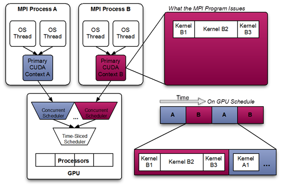
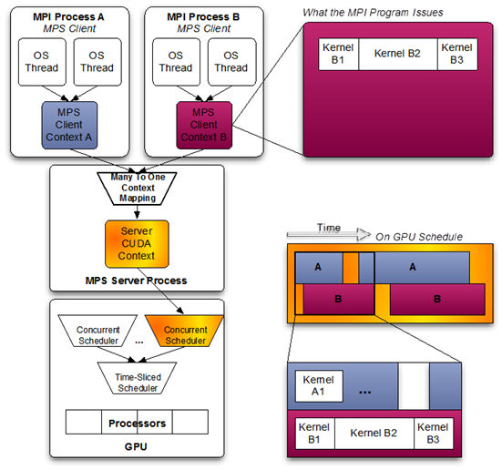

[Compute Preemption](https://docs.nvidia.com/cuda/pascal-tuning-guide/index.html#compute-preemption "Permalink to this headline")
- feature specific to GP100, allows compute tasks running on the GPU to be interrupted at instruction-level granularity
- execution context _(registers, shared memory, etc.)_ are swapped to GPU DRAM 
	- so that another application can be swapped in and run
- offers two key advantages for developers
	- Long-running kernels no longer need to be broken up into small timeslices to avoid 
		- an unresponsive graphical user interface or 
		- kernel timeouts, when a GPU is used simultaneously for compute and graphics
	- Interactive kernel debugging on a single-GPU system is now possible


**CUDA Best Practices**
- Find ways to parallelize sequential code,
- Minimize data transfers between the host and the device,
- Adjust kernel launch configuration to maximize device utilization,
- Ensure global memory accesses are coalesced,
- Minimize redundant accesses to global memory whenever possible,
- Avoid long sequences of diverged execution by threads within the same warp.


**Y MPS?**
- To balance workloads between CPU and GPU tasks, 
	- MPI processes are often allocated individual CPU cores in a multi-core CPU machine 
		- to provide CPU-core parallelization of potential Amdahl bottlenecks. 
	- As a result, the amount of work each individual MPI process is assigned may underutilize the GPU 
		- when the MPI process is accelerated using CUDA kernels. 
	- While each MPI process may end up running faster, the GPU is being used inefficiently. 
- The Multi-Process Service takes advantage of the inter-MPI rank parallelism, increasing the overall GPU utilization
- MPS allows kernel and memcopy operations from different processes to overlap on the GPU, achieving higher utilization and shorter running times
- MPS is useful when each application process does not generate enough work to saturate the GPU
- MPS allows the leftover GPU capacity to be occupied with CUDA kernels running from other processes
  With MPS, the GPU will allow kernel launches from different processes to run concurrently and remove an unnecessary point of serialization from the computation

**What is MPS?**
- MPS is a binary-compatible client-server runtime implementation of the CUDA API wid these components:
	- Control Daemon Process
		- responsible for starting/stopping the server, as well as coordinating connections between clients and servers
	- Client Runtime
		- built into the CUDA Driver library, used transparently by any CUDA application
	- Server Process 
		- clients’ shared connection to the GPU and provides concurrency between clients


**CUDA Startup process**
- A CUDA program starts by creating a CUDA context, 
	- either explicitly using the driver API 
	- or implicitly using the runtime API, for a specific GPU
- The context encapsulates all the hardware resources necessary for the program to be able to manage memory and launch work on that GPU
- Launching work on the GPU typically involves 
	- copying data over to previously allocated regions in GPU memory, 
	- running a CUDA kernel that operates on that data, and then 
	- copying the results back from GPU memory into system memory
- A CUDA kernel consists of a hierarchy of thread groups that execute in parallel on the GPU’s compute engine
- All work on the GPU, launched using CUDA, is launched 
	- either explicitly into a CUDA stream, 
	- or implicitly using a default stream
- A stream is a software abstraction that represents a sequence of commands, which may be a mix of kernels, copies, and other commands, that execute in order
	- Work launched in two different streams can execute simultaneously, allowing for coarse grained parallelism.
- CUDA streams are aliased onto one or more ‘work queues’ on the GPU by the driver
	- Work queues are hardware resources that represent an in-order sequence of the subset of commands in a stream 
		- to be executed by a specific engine on the GPU, such as the kernel executions or memory copies
- GPUs with Hyper-Q have a concurrent scheduler to schedule work from work queues belonging to a single CUDA context
	- Work launched to the compute engine from work queues belonging to the same CUDA context can execute concurrently on the GPU
- The GPU also has a time sliced scheduler to schedule work from work queues belonging to different CUDA contexts
	- Work launched to the compute engine from work queues belonging to different CUDA contexts cannot execute concurrently
- This can cause underutilization of the GPU’s compute resources if work launched from a single CUDA context is not sufficient to use up all resource available to it
- Additionally, within the software layer, to receive asynchronous notifications from the OS and perform asynchronous CPU work on behalf of the application 
	- the CUDA driver may create internal threads: 
		- an upcall handler thread and potentially 
		- a user callback executor thread

**ClientSvr Arch**
- schedule of CUDA kernels when running an MPI application consisting of multiple OS processes without MPS
- while the CUDA kernels from within each MPI process may be scheduled concurrently, 
	- each MPI process is assigned a serially scheduled time-slice on the whole GPU


- When using pre-Volta MPS, server manages the hardware resources associated with a single CUDA context
- CUDA contexts belonging to MPS clients funnel their work through the MPS server
	- This allows client CUDA contexts to 
		- bypass hardware limitations associated with time sliced scheduling, and 
		- permit their CUDA kernels execute simultaneously
- A client CUDA context manages most of the hardware resources on Volta, and submits work to the hardware directly
- The Volta MPS server mediates the remaining shared resources required to ensure simultaneous scheduling of work submitted by individual clients, and stays out of the critical execution path
- The communication between the MPS client and the MPS server is entirely encapsulated within the CUDA driver behind the CUDA API
	- As a result, MPS is transparent to the MPI program.
- MPS clients CUDA contexts retain their upcall handler thread and any asynchronous executor threads
- MPS server creates an additional upcall handler thread and creates a worker thread for each client.



**CUDA MPS**
- When CUDA is first initialized in a program, the CUDA driver attempts to connect to the MPS control daemon
- If the connection attempt fails, 
	- the program continues to run as it normally would without MPS
- If however, the connection attempt succeeds, 
	- the MPS control daemon proceeds to ensure that an MPS server, launched with same user ID as that of the connecting client, is active before returning to the client
	- The MPS client then proceeds to connect to the server
- All communication between the MPS client, the MPS control daemon, and the MPS server is done using named pipes and UNIX domain sockets
- The MPS server launches a worker thread to receive commands from the client
- Successful client connection will be logged by the MPS server as the client status becomes `ACTIVE`
- Upon client process exit, the server destroys any resources not explicitly freed by the client process and terminates the worker thread
	- The client exit event will be logged by the MPS server

**CLI**
- nvidia-cuda-mps-control
	- control daemon is used to manage the `nvidia-cuda-mps-server`
	-  control daemon creates a `nvidia-cuda-mps-control.pid` file that contains the PID of the control daemon process in the `CUDA_MPS_PIPE_DIRECTORY`
	- When there are multiple instances of the control daemon running in parallel, one can target a specific instance by looking up its PID in the corresponding `CUDA_MPS_PIPE_DIRECTORY`
		- If `CUDA_MPS_PIPE_DIRECTORY` is not set, 
			- the `nvidia-cuda-mps-control.pid` file will be created at the default pipe directory at `/tmp/nvidia-mps`
```
man nvidia-cuda-mps-control          # Describes usage of this utility.
nvidia-cuda-mps-control -d           # Start daemon in background process.
ps -ef | grep mps                    # Check if the MPS daemon is running, for Linux.
pidin  | grep mps                    # See if the MPS daemon is running, for QNX.
echo quit | nvidia-cuda-mps-control  # Shut the daemon down.
nvidia-cuda-mps-control -f           # Start daemon in foreground.
nvidia-cuda-mps-control -v           # Print version of control daemon executable (applicable on Tegra platforms only).
```

- nvidia-cuda-mps-server
	- Typically stored under `/usr/bin` on Linux, this daemon is run under the same $UID as the client application running on the node
	- The `nvidia-cuda-mps-server` instances are created on-demand when client applications connect to the control daemon
	- The server binary should not be invoked directly, and instead the control daemon should be used to manage the startup and shutdown of servers
	- The `nvidia-cuda-mps-server` process owns the CUDA context on the GPU and uses it to execute GPU operations for its client application processes
		- Due to this, when querying active processes via `nvidia-smi` (or any NVML-based application) 
			- `nvidia-cuda-mps-server` will appear as the active CUDA process rather than any of the client processes

- nvidia-smi
	- this is used to configure GPUs on a node
```
man nvidia-smi                        # Describes usage of this utility.
nvidia-smi -L                         # List the GPU's on node.
nvidia-smi -q                         # List GPU state and configuration information.
nvidia-smi -q -d compute              # Show the compute mode of each GPU.
nvidia-smi -i 0 -c EXCLUSIVE_PROCESS  # Set GPU 0 to exclusive mode, run as root.
nvidia-smi -i 0 -c DEFAULT            # Set GPU 0 to default mode, run as root. (SHARED_PROCESS)
nvidia-smi -i 0 -r                    # Reboot GPU 0 with the new setting.
```
- Start/Stop MPS Ctrl Daemon
	- Run the cmds as `root`
	- This will start the MPS control daemon that will spawn a new MPS Server instance for any $UID starting an application and associate it with the GPU visible to the control daemon
	- Only one instance of the `nvidia-cuda-mps-control` daemon should be run per node
	- `CUDA_VISIBLE_DEVICES` should not be set in the client process’s environment.
```
export CUDA_VISIBLE_DEVICES=0           # Select GPU 0.
nvidia-smi -i 0 -c EXCLUSIVE_PROCESS    # Set GPU 0 to exclusive mode.
nvidia-cuda-mps-control -d              # Start the daemon.
echo quit | nvidia-cuda-mps-control     # shut down daemon
```
- Log Files
	- view the status of the daemons by viewing the log files in
		- `/var/log/nvidia-mps/control.log`
		- `/var/log/nvidia-mps/server.log`
	- These are typically only visible to users with administrative privileges

