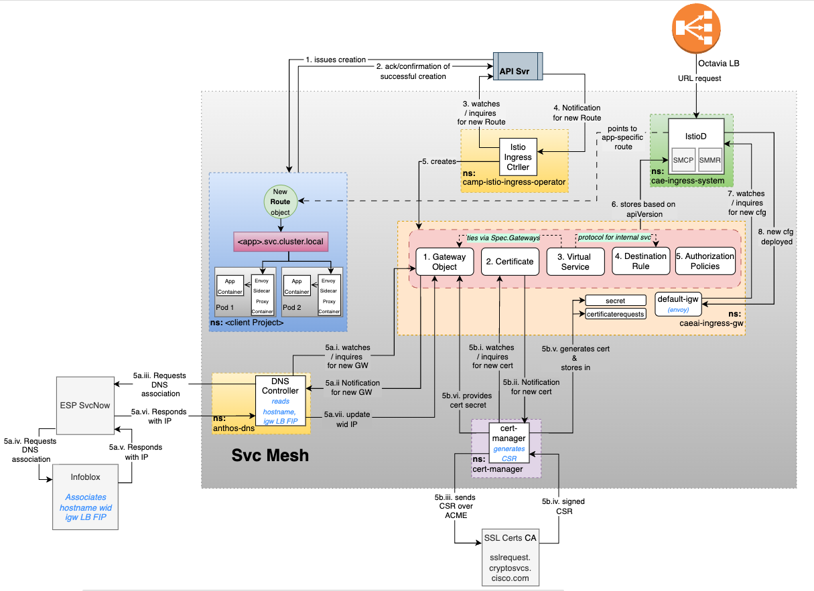

**Istio Ingress Ctrller**

- Istio Ingress Ctrller calls API svr & inquires if any new Route object got created in any ns
	- So it watches for creation of a new route object & gets notified
- Once notified about new route object creation,
	- Istio Ingress Ctrller looks at the details of the hostname n other details
		- Then it goes into `caeai-ingress-igw` ns n creates all these objects in the following sequence
			- GW object
				- DNS
			- cert object
			- VirtualService object
			- DestinationRule object
			- AuthorizationPolicies object
		- All these 5 cfgs r meant for istioD

**Gateway Object:**
- For each new route created across any ns, *that is monitored by istioD*, 
	- 1 equivalent gw object is created in `caeai-ingress-igw` ns 
	- Spec of this gw object informs details of new host & port to connect to
- This gw object gets created in the `default-igw` gw pod that has the label set as `app=default-igw`
	- **Validation:**  `ocg po -A -l app=default-igw` displays the GW pod whr this GW object is applied to
- `default-igw` is basically an envoy proxy svr
	- envoy fetches/polls cfg info from istioD, via API endpoint, in real-time to read cfg, rather than storing cfg, unlike ha-proxy/apache etc
- **Summary:**
	- gw object is created under istio's cfg, as its apiVersion is set to `networking.istio.io/v1beta1`
	- So, istioD gets this cfg n ensures that this whole cfg of hosts @ port 80 n 443, should be applied to pod, that includes the label `app=default-igw`
	- And then istioD sends that gw object cfg to `default-igw` via proxy `default-igw`, running in istioD
- **Workflow:**
	- Istio Ingress Ctrller creates new GW Object, by setting apiVersion of Istio, making it store in IstioD
	- envoy proxy in default-igw pod, polls/pulls this cfg from IstioD


**Custom Resources for svcMesh**
- These r pieces of extra code on top of IstioD to simplify certain processes
	- **SMCP** - SvcMeshCtrlPlane
		- defines cfg & deployment details for svc mesh ctrl plane, for components like Pilot, Mixer & Ingress/Egress GWs
		- generates a cfgMap, that has some cfg for IstioD to read, thereby, responsible for configuring IstioD
		- see details of cfg setup by executing `ocd smmr default -n caeai-ingress-system`
	- SMMR - SvcMeshMemberRoll
		- defines which ns r part of svc mesh ctrl plane; to allow svc mesh to manage cfg for workloads in those ns
			- any cfg of Istio, in all these ns, should b read by IstioD
			- `caeai-ingress-igw` is also part of SMMR, so, that is how istioD is controlling `default-igw`
		- see details of its cfg setup by executing `ocd smmr default -n caeai-ingress-system`

- **DNS:**
	- event-driven arch setup named **DNS Controller**, configured to look for any istio GW object, that talks to a svc of type LoadBalancer, in this case `default-igw`
	- As soon as a svc of type LoadBalancer is created, 
		- openShift also has a ctrller running, that talks to openStack, to invoke openStack API
			- This openStack API creates 2 VMs, wid HA Proxy inside it, that act as a LoadBalancer for it, 
				- represented as a Floating VIP _(FIP)_ b/w 2 VMs
				- This FIP is set as external IP for svc of type LoadBalancer
	- As per CaaS Team's configuration, if any Istio GW object is configured to a GW pod and 
		- that GW pod has a svc of type LoadBalancer, in this case, `default-igw`
			- Then, add that DNS automatically to that FIP
			- So, nslookup of any workbench URL will give same FIP as that of its GW, i.e., `default-igw`
	- So, DNS Ctrller is also using GW object & internally it reads GW object to get info abt wht pod is configured & if thr is a svc of type LoadBalancer, which is also referenced
		- So, based on all that, it figures out Octavia Public IP and 
			- then it talks to ESP svc (svcNow)
				- It is this svcNow that creates the DNS entry via infoblox
	- **Summary:** <-- Get this workflow reviewed by **Rajesh**
		- DNS Controller watches for creation of GW object
		- Once notified, DNS Controller 
			- reads details about pod, where GW object is created & 
			- validates if that pod has a svc configured as type LoadBalancer
			- If yes, then it proceeds to 
				- request new IP by requesting ESP SvcNow to request creation of new IP via infoblox IPAM, 
				- get it registered in DNS, by Infoblox and then 
				- add that IP in same DNS as that of GW svc's external IP, i.e., FIP


**Certificates:**
- Now to make the GW run, we need SSL cert, stored in same `caeai-ingress-igw` ns
	- Validate what secret is used in gw object by executing `ocd gw jas-wb1-jas-poc--default -n caeai-ingress-igw`
		- Then, validate secret by executing `ocg secret jas-wb1-jas-poc.rtp-dev-01.cisco.com -n caeai-ingress-igw`
			- This cert contains TLS Cert `tls.crt` wid `tls.key`
			- Then, execute `oc view-secret jas-wb1-jas-poc.rtp-dev-01.cisco.com -n caeai-ingress-igw -a`
				- This gives the CSR in proper format
			- To validate details, copy paste the secret in Certificate Decoder @ https://sslshopper.com/certificate-decoder.html _(if its non-sensitive)_
- Who writes this cert?
	- As soon as we hv route object created, we hv to fetch the TLS cert
	- `cert-manager` running on the cluster, is configured in such a way that within Cisco; Cisco has its own private SSL Cert provider, that also implements ACME protocol
		- This `cert-manager` talks to that SSL cert provider using ACME protocol _(Automatic Cert Mgmt Environment)_ & requests internal SSL Cert provider to sign that route for new workbench
		- Svc provider performs nslookup of DNS, to validate if DNS exists
- Cert Details specify that cert has been created wid this commonName & DNS entry; wid commonName to be mandatory
	- It works only if your workbench is added as a dnsName and not as a commonName; as commonName can be anything but not DNS name
	- duration is set to 15 days
	- most importantly, it tells that once this cert is ready, put it in this secret
		- specifies secret name, whr cert needs to be stored in
- Felix creates this cert object & 
	- cert-manager, in `cert-manager` ns, will read cert object, then 
		- talks via ACME protocol to internal SSL Cert provider,
		- fetches the TLS cert from internal SSL Cert provider (CA) &
		- eventually will generate the secret reqd _(this secret is referenced in the GW)_, 
			- This secret is needed by GW for TLS termination
- For each cert object created by Istio Ingress Ctrller, cert-manager creates an equivalent `certificatesrequests` object in `caeai-ingress-igw` ns 
	- with CSR generated & stored in it, wid issuer being `cisco-acme`
- Explore more abt diff. objects avl for certs by executing `oc api-resources | grep cert`, to understand how these r inter-connected
	- Validate CSR by executing `ocd certificaterequests jas-wb1-jas-poc.rtp-dev-01.cisco.com-default-1 -n caeai-ingress-igw` 
- **Summary:**
	- Once Istio Ingress Operator creates a cert object, 
		- cert-manager ctrller, that watches creation of a cert object, gets notified and
			- reads details from cert object related to hostname & 
			- generates CSR
			- creates `certificaterequests` object in `caeai-ingress-igw` ns & 
				- stores generated CSR in this object, with issuer being `cisco-acme`
			- connects to SSL Certs CA to request the CSR to be signed 
			- SSL Certs CA  
				- performs DNS lookup to validate is provided hostname resolves to an IP
				- if provided hostname resolves to an IP, then SSL Certs CA signs CSR
				- sends back signed CSR
			- stores signed CSR in a secret in vault / secret store (keeper.cisco.com ??)
			- provides secret name to GW object, for it to run successfully



- **VirtualService:**
	- Gateway just knows that on what host n what port, should u listen to the traffic, with what kind of protocol
		- And if protocol is HTTPS, then what is the TLS cert
		- GW tells only this much
	- VS has info that  *(execute `ocd vs jas-wb1-jas-poc.rtp-dev-01.cisco.com-default -n caeai-ingress-igw` to understand details)*
		- this VS should be on effect on this GW
			- This GW name `jas-wb1-jas-poc--default` in `Spec.Gateways.caeai-ingress-igw/jas-wb1-jas-poc--default` is the same name as that of 
				- GW object name *(check **Name:** in `ocd gw jas-wb1-jas-poc--default -n caeai-ingress-igw`)* 
			- Thats how this VS `jas-wb1-jas-poc.rtp-dev-01.cisco.com-default` ties in wid this GW `jas-wb1-jas-poc--default`
			- for this host, these r the things that should be done, like
				- removing certain headers
				- anything that is matching wid `/`, send that to this destination clusterIP svc

```json
Name:         jas-wb1-jas-poc.rtp-dev-01.cisco.com-default
Namespace:    caeai-ingress-igw
Labels:       namespace=jas-poc
              sso=default
Annotations:  host: jas-wb1-jas-poc.rtp-dev-01.cisco.com
API Version:  networking.istio.io/v1beta1
Kind:         VirtualService
Metadata:
  Finalizers:
    istio-ingress-operator/finalizer
Spec:
  Gateways:
    caeai-ingress-igw/jas-wb1-jas-poc--default
```

- **DestinationRule:**
	- defines protocol to inform if connectivity from `default-igw` to app's internal clusterIP `svc.cluster.local` is plain HTTP or (HTTP2/TCP/TLS) svc
		- Check `ocd dr jas-wb1-jas-poc.rtp-dev-01.cisco.com-jas-wb1-tls-443` for details
		- This internal svc name of app is specified as `destination` in VS
	- specifies port no.

- based on all this knowledge now, `default-igw` knows that wenevr traffic for a specific URL comes, it needs to be routed to a specific ns

- **netpol:**
	- usually ns2ns communication is not allowed in multi-tenancy
		- so, netpol needs to be setup to allow ns2ns communication
			- Execute `ocd netpol allow-from-openshift-ingress -n jas-poc` for more details
			- For each ns, netpol needs to be setup, that allows from all ns that has this specific label selector `NamespaceSelector: network.openshift.io/policy-group=ingress` 
			- This label is set for `caeai-ingress-igw` ns as one of the few ns that hv full-blown access to client ns
				- Execute `ocg ns -l network.openshift.io/policy-group=ingress` to see list of all ns that have full-blown access to all client ns
	- So, this was the traffic flow for a simple notebook

```json
ocg ns -l network.openshift.io/policy-group=ingress                                                                                                                    
	NAME                      STATUS   AGE
	caeai-ingress-igw         Active   145d
	caeai-ingress-system      Active   145d
	istio-system              Active   146d
	knative-serving           Active   38d
	openshift-host-network    Active   146d
	openshift-ingress         Active   146d
	redhat-ods-applications   Active   130d
```